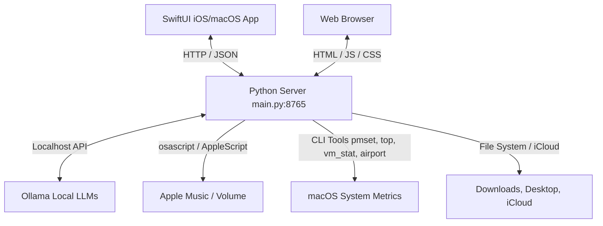

# 🖥️ Mac Agent: Local System Monitor, File Assistant & AI Chat

A powerful, two-part system for local control, monitoring, and AI-powered organization of your Mac. It consists of a lightweight **Python backend** (with an integrated web dashboard) and a native, stunning **SwiftUI client** for iOS, iPadOS, and macOS (via Catalyst) featuring a modern **Liquid Glass Design**.

All communication is handled locally within your home network or via a secure connection like Tailscale.

---

## 🏗️ System Architecture

The system runs entirely locally on your Mac and communicates via a simple JSON REST API.



---

## ✨ Features

### 📊 System Monitoring & Live Dashboard
*   **CPU & RAM:** Real-time utilization using `top` and `vm_stat` / `sysctl` (including page size calculations for Apple Silicon).
*   **GPU:** GPU HW active residency (in %) via Apple Silicon-specific `powermetrics`.
*   **Power & Network:** Battery charge level (%), charging source detection, remaining runtime (via `pmset`), and Wi-Fi connection status (SSID and signal strength).
*   **Process Monitor:** Displays the top 15 processes sorted by CPU and memory usage (`ps aux`).

### 🎵 Media & System Control
*   **Apple Music Integration:** Reads track name, artist, play position, and total duration. **Extracts the album artwork directly as Base64 data** using AppleScript!
*   **Playback Control:** Skip tracks, go back, and Play/Pause.
*   **System Volume:** Adjust system volume level and toggle mute/unmute via slider.

### 📁 File Manager & AI File Assistant (Mac Agent)
*   **File Browser:** Navigate authorized Mac directories (Downloads, Desktop, Documents, iCloud Drive).
*   **Natural Language Commands:** Move documents with commands like *"Move the PDF script Rome from Desktop to iCloud"*.
*   **LLM Processing:** A local LLM automatically extracts search keywords and the destination folder.
*   **Confirmation Workflow:** Searches for the most relevant files and offers interactive confirmation before moving them.

### 💬 Multimodal AI Chat
*   **Local LLMs:** Chat with models like `gemma4`, `qwen3:4b`, `phi3:mini`, or `ibm/granite4:3b` via Ollama.
*   **Vision Support:** Multimodal interaction using `gemma4-vision` to analyze uploaded images.
*   **Document Processing:** PDFs are read using `pymupdf` and fed directly as text into the chat context.

---

## 🔌 API Reference (Endpoints)

The Python server runs on port `8765` and provides the following endpoints:

| Method | Path | Description |
|---|---|---|
| `GET` | `/` | Serves the integrated web dashboard (HTML/JS/CSS). |
| `GET` | `/status` | Returns all system statistics (CPU, RAM, GPU, Wi-Fi, battery, processes, Apple Music). |
| `POST` | `/list` | Lists files in an authorized directory. |
| `POST` | `/move-doc` | Directly moves a file to a new location. |
| `POST` | `/volume` | Sets the system volume (0–100). |
| `POST` | `/mute` | Mutes/unmutes the audio output. |
| `POST` | `/media-control` | Triggers playback actions (`playpause`, `next`, `previous`) for Apple Music. |
| `POST` | `/ai-move` | Processes natural language commands via Ollama and searches for matching files. |
| `POST` | `/ai-confirm` | Confirms and executes the AI file move action. |
| `POST` | `/ai-chat` | Sends the chat history (including image payloads for vision models) to Ollama. |
| `POST` | `/process-file` | Processes uploaded PDFs or images. |

---

## 🛠️ Step-by-Step Setup Guide

### Part 1: The Mac Backend (Python Server)

The backend consists of a single file (`main.py`) running a multi-threaded HTTP server to handle concurrent requests (e.g., from the Web UI and the iOS App simultaneously) without blocking.

#### 1. Install Prerequisites
Ensure Python 3.13 or newer is installed. Install the required dependency for PDF text extraction:
```bash
pip3 install pymupdf --break-system-packages
```

#### 2. Set Up Ollama & Models
1. Download and start [Ollama for Mac](https://ollama.com).
2. Download your preferred LLMs:
   ```bash
   ollama pull gemma4
   ollama pull ibm/granite4:3b
   ollama pull qwen3:4b
   ollama pull phi3:mini
   ```
3. *(Optional)* To extend Gemma's context window size, create a `Modelfile` in the project directory:
   ```dockerfile
   FROM gemma4
   PARAMETER num_ctx 8192
   ```
   Then build the model in Ollama:
   ```bash
   ollama create gemma4 -f ./Modelfile
   ```

#### 3. Start & Stop the Backend
Use the provided shell scripts in the project directory:
*   **Start:** `./start.sh` (runs the backend in the background and writes to `agent.log`).
*   **Stop:** `./stop.sh` (terminates the server using the stored `agent.pid`).

Alternatively, run it directly in your terminal:
```bash
python3 main.py
```

The built-in web dashboard can now be accessed at `http://localhost:8765` in any web browser.

---

### Part 2: The Native iOS & macOS Client (SwiftUI)

The client is built using SwiftUI in Xcode. It features a stunning **Liquid Glass Design** with blurred glass card effects (`.ultraThinMaterial`), haptic feedback on interactions, and automated system state refreshing.

#### 1. Create Xcode Project
1. Open Xcode on your Mac and click **Create New Project**.
2. Under **Platform: iOS**, select the **App** template.
3. Use the following settings:
   *   **Product Name:** `MacAgent`
   *   **Interface:** SwiftUI
   *   **Language:** Swift
   *   **Bundle Identifier:** e.g., `de.yourname.macagent`
4. Choose a directory and create the project.

#### 2. Add Code Files
Delete the automatically generated files `ContentView.swift` and `MacAgentApp.swift` in the Project Navigator, and drag all Swift files from the `swift/MacAgentApp` directory into your Xcode project:

*   **`MacAgentApp.swift`**: Application entry point. Initializes the config and API state.
*   **`ContentView.swift`**: Manages tab navigation and layout responsiveness.
*   **`Models.swift`**: Defines JSON decodable data structures and the `AgentAPI` client.
*   **`SharedComponents.swift`**: Global UI styles, frosted glass backdrops, and colors.
*   **`StatusView.swift`**: The dashboard view containing gauges and process listings.
*   **`MediaView.swift`**: Apple Music player with controls and album cover presentation.
*   **`FileView.swift`**: Built-in file browser.
*   **`AgentView.swift`**: AI assistant view for voice/text file operations.
*   **`ChatView.swift`**: Chat interface supporting model selection and camera/photo uploads.

*Note:* Check **"Copy items if needed"** during the import dialog.

#### 3. Enable Local Network Access (Info.plist)
Since the app communicates over HTTP with your Mac, you must configure network permission settings.
Select the `MacAgent` project root in Xcode, go to the **Info** tab, and add the following keys:

1. **App Transport Security Settings** (`NSAppTransportSecurity`)
   *   Underneath, add **Allow Arbitrary Loads** (`NSAllowsArbitraryLoads`) and set it to `YES` (enables plain HTTP connections).
2. **Privacy - Local Network Usage Description** (`NSLocalNetworkUsageDescription`)
   *   Value: `For connecting to the Mac Agent on the local network.`
3. **Bonjour services** (`NSBonjourServices`)
   *   Add one item: `_http._tcp`

Alternatively, open `Info.plist` as source code (XML) and insert this block:
```xml
<key>NSAppTransportSecurity</key>
<dict>
    <key>NSAllowsArbitraryLoads</key>
    <true/>
</dict>
<key>NSLocalNetworkUsageDescription</key>
<string>For connecting to the Mac Agent on the local network.</string>
<key>NSBonjourServices</key>
<array>
    <string>_http._tcp</string>
</array>
```

#### 4. Code Signing & Deployment
1. Select the project and navigate to the **Signing & Capabilities** tab.
2. Under **Team**, choose your Apple Developer account (a free personal account is sufficient).
3. Connect your iPhone/iPad to your Mac via USB, select it as the target device in Xcode, and click the **Run button (▶)**.
4. Launch the app on your iOS device, go to **Settings** (gear icon in the tab bar), and type in your **Mac's local IP address** (e.g., `192.168.1.100`, Port `8765`).

---

## 📶 Access from Anywhere (Tailscale)

If you want to control your Mac Agent when you are away from home:
1. Install [Tailscale](https://tailscale.com) on both your Mac and your iOS device.
2. Connect both to your personal tailnet.
3. Put the **Tailscale IP address** of your Mac into the settings tab in the iOS App. Since the Python server listens on `0.0.0.0`, remote control will work seamlessly and fully encrypted!
